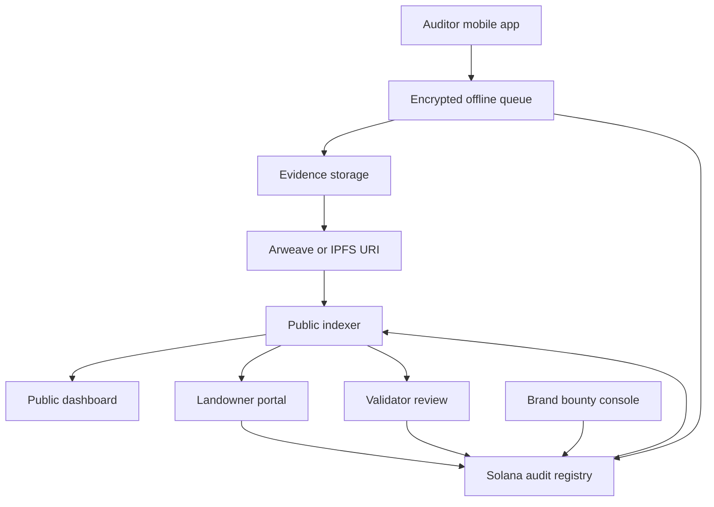

# Architecture

## System Overview

FieldProof uses a hybrid decentralized architecture.



## Mobile Auditor App

Responsibilities:

- Download assigned bounties.
- Cache offline map tiles.
- Capture field evidence.
- Generate hashes.
- Store signed audit packets offline.
- Sync when connectivity returns.

Important constraints:

- No gallery uploads for primary evidence.
- Capture GPS, timestamp, device state, and parcel boundary context.
- Keep local data encrypted.
- Support low-bandwidth retry logic.

## Evidence Packet

Evidence packets should be portable JSON bundles with attached media.

Example fields:

```json
{
  "schemaVersion": "0.1",
  "auditId": "audit_mx_chp_1198_001",
  "farmId": "MX-CHP-1198",
  "claimType": "riparian_buffer_health",
  "capturedAt": "2026-06-18T15:47:00Z",
  "coordinates": {
    "lat": 16.7561,
    "lng": -92.6374,
    "accuracyMeters": 6.2
  },
  "media": [
    {
      "type": "image/jpeg",
      "sha256": "9f32b1c7e8a0f44d91c2a6b77f0d18e59af4e2c330a9bd76e6f2c18a4c12b908",
      "storageUri": "ar://example"
    }
  ],
  "checklist": {
    "bufferWidthEstimateMeters": 8,
    "visibleErosion": true,
    "recentClearingVisible": false
  },
  "auditorSignature": "example_signature"
}
```

## On-Chain Registry

The chain should store compact public state:

- Farm ID.
- Audit ID.
- Evidence packet hash.
- Evidence storage URI.
- Auditor public key.
- Bounty ID.
- Status.
- Appeal state.
- Validator decision references.

It should not store raw image data.

## Public Dashboard

The dashboard reads indexed registry events and evidence metadata.

Views:

- Global map.
- Farm profile.
- Audit timeline.
- Evidence integrity inspector.
- Brand transparency profile.
- Consumer QR proof page.

## Self-Hosting Model

Minimum self-hosted deployment:

- Static dashboard.
- Small read-only API/indexer.
- Public RPC configuration.
- Decentralized evidence gateway configuration.

Long-term goal:

Anyone should be able to run a mirror of the public dashboard from the same open audit records.

